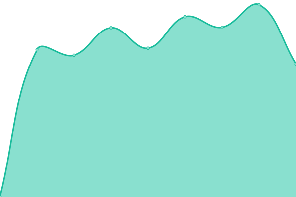

<!--start: status pages-->
<!-- This summary is generated by Upptime (https://github.com/upptime/upptime) -->
<!-- Do not edit this manually, your changes will be overwritten -->
<!-- prettier-ignore -->
| URL | Status | History | Response Time | Uptime |
| --- | ------ | ------- | ------------- | ------ |
|  [L1](https://l1.babeldat.com) | 🟩 Up | [l1.yml](https://github.com/Babeldat/upptime/commits/HEAD/history/l1.yml) | 

 946ms
     
 | 

<a href="https://uptime.babeldat.com/history/l1">100.00%</a>
    

|  [L2](https://l2.babeldat.com) | 🟩 Up | [l2.yml](https://github.com/Babeldat/upptime/commits/HEAD/history/l2.yml) | 

 911ms
     
 | 

<a href="https://uptime.babeldat.com/history/l2">99.66%</a>
    

|  [L3](https://l3.babeldat.com) | 🟩 Up | [l3.yml](https://github.com/Babeldat/upptime/commits/HEAD/history/l3.yml) | 

 597ms
     
 | 

<a href="https://uptime.babeldat.com/history/l3">100.00%</a>
    

|  [L4](https://l4.babeldat.com) | 🟩 Up | [l4.yml](https://github.com/Babeldat/upptime/commits/HEAD/history/l4.yml) | 

 954ms
     
 | 

<a href="https://uptime.babeldat.com/history/l4">100.00%</a>
    

|  [L5](https://l5.babeldat.com) | 🟩 Up | [l5.yml](https://github.com/Babeldat/upptime/commits/HEAD/history/l5.yml) | 

 639ms
     
 | 

<a href="https://uptime.babeldat.com/history/l5">100.00%</a>
    

|  [L6](https://l6.babeldat.com) | 🟩 Up | [l6.yml](https://github.com/Babeldat/upptime/commits/HEAD/history/l6.yml) | 

 633ms
     
 | 

<a href="https://uptime.babeldat.com/history/l6">100.00%</a>
    

|  [L8](https://l8.babeldat.com) | 🟩 Up | [l8.yml](https://github.com/Babeldat/upptime/commits/HEAD/history/l8.yml) | 

 626ms
     
 | 

<a href="https://uptime.babeldat.com/history/l8">100.00%</a>
    

|  [Sandbox](https://sb.babeldat.com) | 🟩 Up | [sandbox.yml](https://github.com/Babeldat/upptime/commits/HEAD/history/sandbox.yml) | 

 964ms
     
 | 

<a href="https://uptime.babeldat.com/history/sandbox">100.00%</a>
    

<!--end: status pages-->
