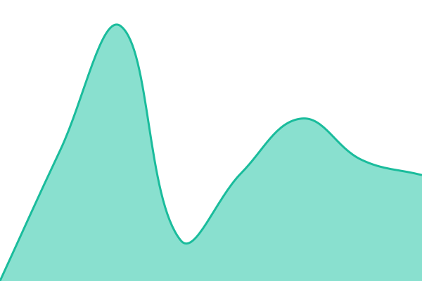
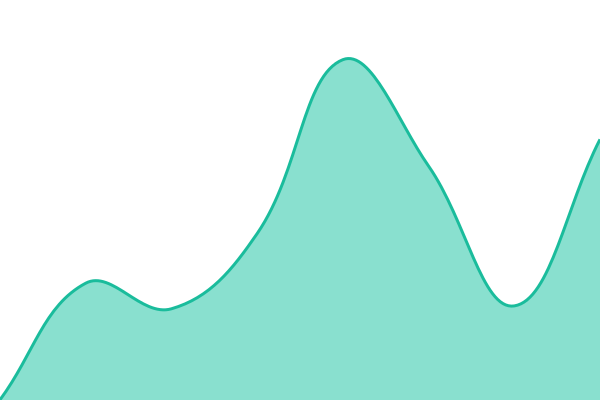

<!--start: status pages-->
<!-- This summary is generated by Upptime (https://github.com/upptime/upptime) -->
<!-- Do not edit this manually, your changes will be overwritten -->
<!-- prettier-ignore -->
| URL | Status | History | Response Time | Uptime |
| --- | ------ | ------- | ------------- | ------ |
|  [L1](https://l1.babeldat.com) | 🟩 Up | [l1.yml](https://github.com/Babeldat/upptime/commits/HEAD/history/l1.yml) | 

 1265ms
     
 | 

<a href="https://uptime.babeldat.com/history/l1">99.78%</a>
    

|  [L2](https://l2.babeldat.com) | 🟩 Up | [l2.yml](https://github.com/Babeldat/upptime/commits/HEAD/history/l2.yml) | 

 1059ms
     
 | 

<a href="https://uptime.babeldat.com/history/l2">99.66%</a>
    

|  [Sandbox](https://sb.babeldat.com) | 🟩 Up | [sandbox.yml](https://github.com/Babeldat/upptime/commits/HEAD/history/sandbox.yml) | 

 1242ms
     
 | 

<a href="https://uptime.babeldat.com/history/sandbox">100.00%</a>
    

<!--end: status pages-->
